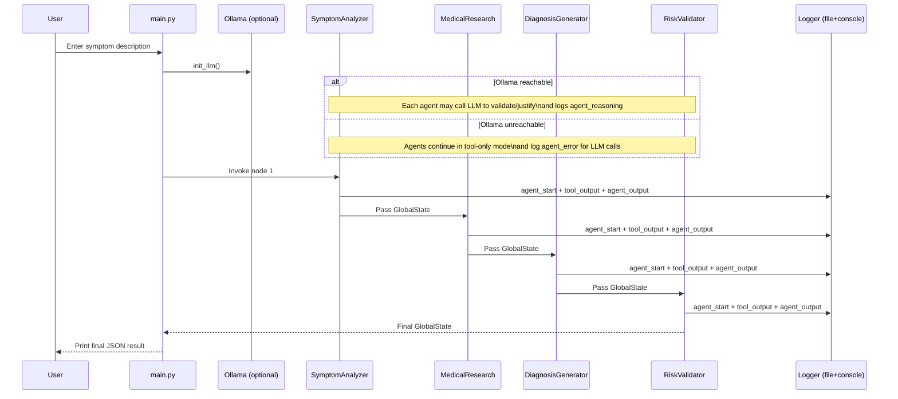

# DiagnoSmart System Overview (For Report)

```mermaid
flowchart LR
  U[User] -->|symptom text| CLI[CLI Entrypoint\n`diagnosmart/main.py`]

  CLI --> INIT[init_llm()\nChatOllama (optional)]
  INIT -->|llm or None| WG[LangGraph Workflow\nStateGraph(GlobalState)]

  subgraph STATE[Shared Global State (GlobalState)]
    S0[user_input]
    S1[symptoms + duration + severity]
    S2[conditions]
    S3[advice]
    S4[risk_level]
  end

  WG --> A1[Agent 1: Symptom Analyzer\n`run_symptom_analyzer`]
  A1 -->|updates| S1
  A1 --> T1[Tool: Symptom Parser\n`extract_symptoms`]

  WG --> A2[Agent 2: Medical Research\n`run_medical_research`]
  A2 -->|updates| S2
  A2 --> T2[Tool: Disease Lookup\n`find_conditions`]
  T2 --> D1[(Local Data\n`data/diseases.json`)]

  WG --> A3[Agent 3: Diagnosis Generator\n`run_diagnosis_generator`]
  A3 -->|updates| S3
  A3 --> T3[Tool: Advice Generator\n`generate_advice`]

  WG --> A4[Agent 4: Risk Validator\n`run_risk_validator`]
  A4 -->|updates| S4
  A4 --> T4[Tool: Risk Assessment\n`assess_risk`]

  A1 --> A2 --> A3 --> A4

  A4 --> OUT[Final Output JSON\nsymptoms, conditions, advice, risk_level]

  subgraph OBS[Observability / Logging]
    L[log_event(...)] --> F[(JSON Log File\n`diagnosmart/diagnosmart.log`)]
    L --> C[Console Timeline\nSTART/TOOL/DONE/ERROR]
  end

  A1 --> L
  T1 --> L
  A2 --> L
  T2 --> L
  A3 --> L
  T3 --> L
  A4 --> L
  T4 --> L

  INIT -. if Ollama down .->|tool-only mode| WG
```



Notes:
- The reference implementation lives under `diagnosmart/`.
- A functionally equivalent demo entrypoint exists at `member_handoffs/shared_integration/main.py`.
